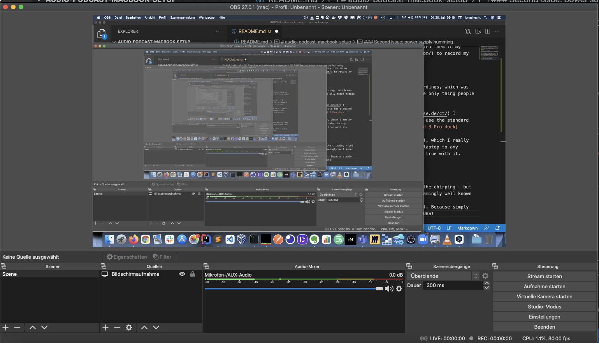
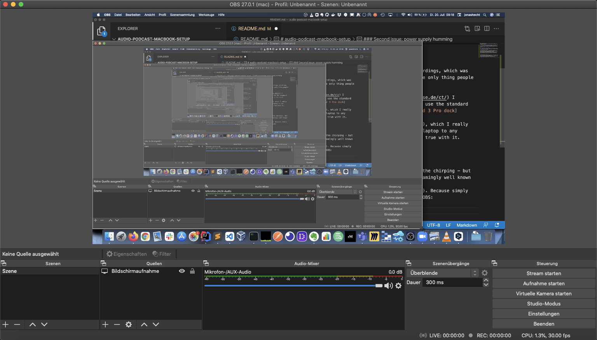
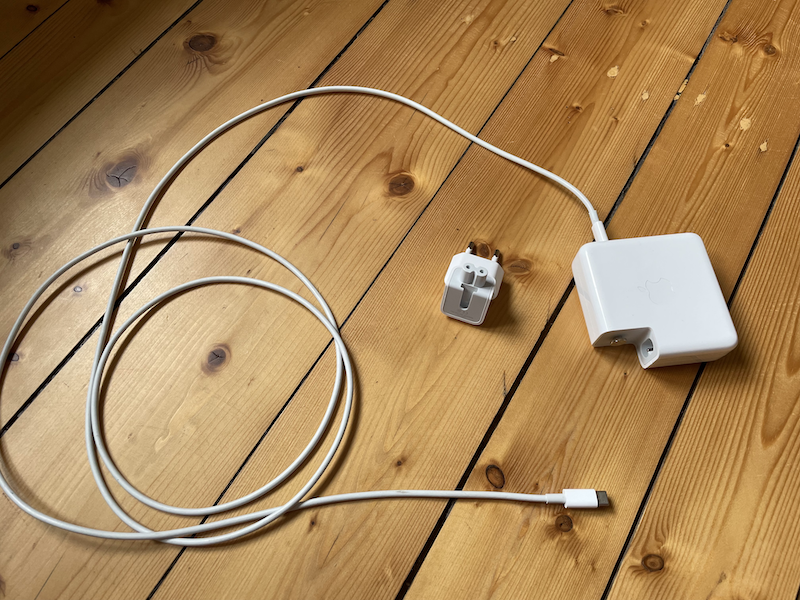
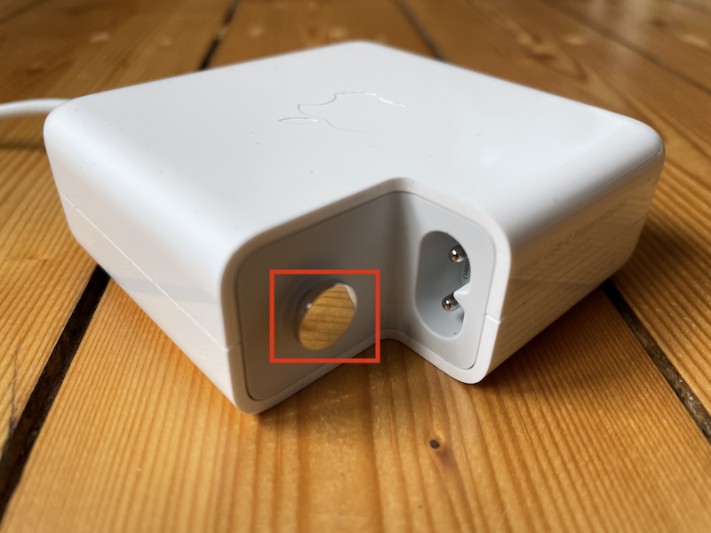
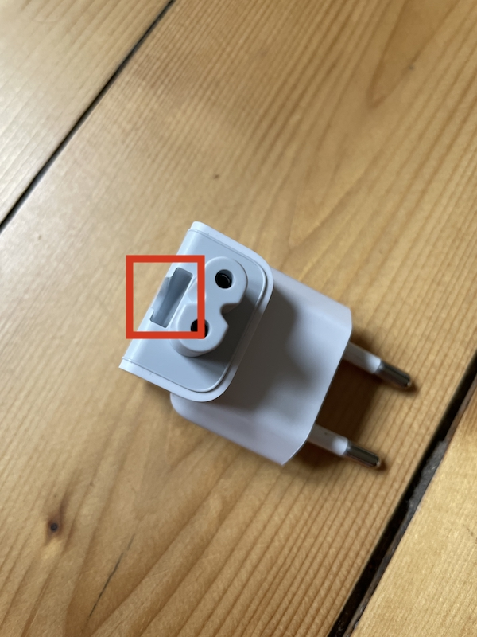
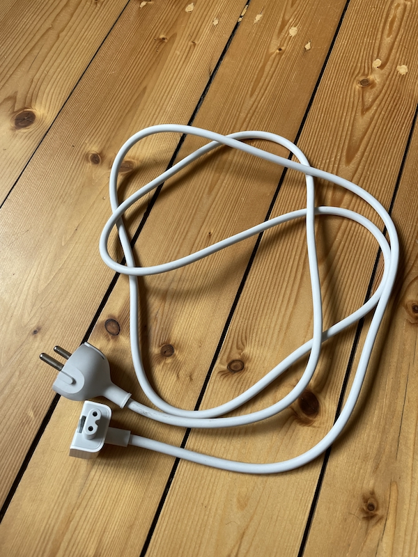
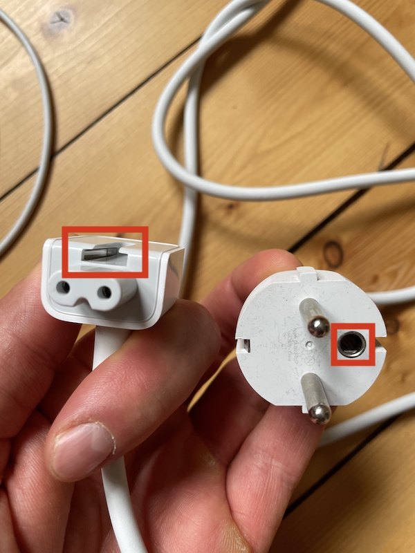

# audio-podcast-macbook-setup
Setup considerations for a great audio recording experience on a MacBook Pro 16'' with AKG C 520 + Rode AI-1

I "only" wanted to record some podcast and online courses - and thus bought a [AKG C 520 Vocal Microphone](https://www.thomann.de/de/akg_c_520.htm) and [Rode AI-1 Audiointerface](https://www.thomann.de/de/rode_ai_1.htm), connected them to my MacBook Pro 16'' (2020) and installed [OBS](https://obsproject.com/) to record my screen and voice...

### First issue: chirping on the recording

But - as always - it wasn't that easy. I got a chirp on the recordings, which was quite nasty since my voice - together with my screencast - is the only thing people get when the listen to my recordings. 

As a long year reader of the great [c't Magazin](https://www.heise.de/ct/) I removed the power supply of my mac to see what happens. I didn't use the standard power supply, but in my setup I used the 349€ [Belkin Thunderbold 3 Pro dock](https://www.belkin.com/de/business/hubs-and-docks-for-business/docking-stations-for-business/thunderbolt-3-dock-pro/p/p-f4u097/), which I really loved since the old dream of using only one cable to connect my laptop to any device (USBs, Ethernet, power supply, external displays...) came true with it.

### Second issue: power supply humming

Now having disconnected the Belkin doc, my recording got rid of the chirping - but now there was a humming. After googling around I soon found a seamingly well known issue: [the magic hand issue](https://sendegate.de/t/macbook-pro-2016-netzbrummen-magische-hand-und-interface/4732/12). Because simply touching my MacBook the humming was gone. I could "see" that in OBS:

and touching my MacBook:

This leads us to the root cause of the humming: no proper grounding! After a while of googling and thinkering it became clear to me. Current MacBooks don't ship with a grounded! TODAY! Having a look at the power supply this becomes obvious:

In the detail view you see the 2 power supply conductors. And the bigger round grounding plug:

**But** looking a the plug there's only plastic inside!!

So our MacBook Pro does not get grounded with the 2020/21 power supply setup.

But there's help! Many people suggest [to build your own cable](https://sendegate.de/t/bastelecke-erdungskabel-gegen-50hz-netzbrummen/3262) which is definitely possible, but not without risks for the non-electrically trained (like me). But I'm working with MacBooks since 2015 and luckily I have every cable right in my cellar - even the old extension cable from my MacBook Pro 2015! Let's have a detailled look onto it:

and especially the plugs:

There's metal inside the power supply plug - and it's grounded into the socket! Using this cable together with my MacBook Pro 16'' power supply I got rid of the humming!

### Third issue: a sublte humming

After getting rid of the chirping and humming I started to get my first usable audio recordings. But there was a subtle humming left - not noticable on screen looking at OBS, but I heard it when using headphones and turining up the volume a bit more. But I also got rid of this last audio recording issue: I simply used [OBS' noice suppression option](https://obsproject.com/forum/threads/rauschunterdr%C3%BCckung.117913/). Therefore right click onto your microphone in OBS and click on `Filter`. There create a new filter from the `+` menu using `noise suppression` (or `Rauschunterdrückung` in german).